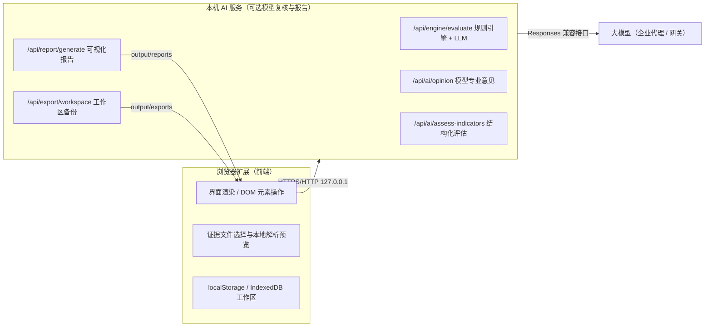
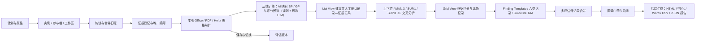

# AuditFlow v7.6 AI 功能覆盖与部署边界

## v7.6 前后端分离架构

## ASPICE 评估主流程

## 功能覆盖

| 能力域 | Web 工作台实现 | 当前数据方式 |
|---|---|---|
| ASPICE 过程评估 | 顶部十阶段评估流、属性、多个过程实例、参与者、角色和独立工作区 | 浏览器本地持久化 |
| BP/GP AI 评定结果 | 按正式范围过程与 PA 分组的 AI 初稿、八档评分、证据角色、缺口筛选、人工改定和核对详情 | 当前评估版本 + 浏览器本地持久化 |
| MAN.3 / SUP.8 专项子项目 | 父项目一键生成、上传文件问题识别、Issue → BP/GP 候选配对、逐项人工复核、候选追溯/弱项/证据一键回写 | 浏览器本地持久化；只对父项目正式范围内指标形成正式候选 |
| 现场执行 | 左侧过程域轨道、Grid View 逐条 BP/GP 快速评分、右侧记录/证据检查器、键盘快捷记录、Notepad 与实时筛选 | 浏览器本地持久化 |
| 评估师记录 | Strength、Weakness、Recommendation、Observation、Comment、Question；关联指标、实例、工作区和证据 | 浏览器本地持久化 |
| 一致性检查 | Guideline / TAA 的 Broken、Suspect、Handled 状态，评分变更后自动复算 | 本地规则引擎 |
| 多人合并 | 独立评估师记录、Consolidated 正式工作区、逐条或批量合并 | 浏览器本地持久化 |
| 功能安全审核 | ISO 26262 生命周期模板、范围/计划/证据/分析/复核/关闭、HARA/FSC/TSC、HW/SW、V&V、支持过程和 Safety Case | 本地规则 + 浏览器人工复核 |
| 网络安全审核 | ISO/SAE 21434 生命周期模板、治理、TARA/概念、开发验证、持续活动、发布和 Cybersecurity Case | 本地规则 + 浏览器人工复核 |
| 自定义审核 | 方案、分类、单条/批量问题、判断参考、任务、逐题评估、结论和 Word 报告 | 浏览器本地持久化 |
| 多用户协作预览 | Microsoft 用户 ID、项目角色、证据/分析/复核/关闭权限、租户隔离、修订号、事件日志和冲突轮询 | 本地预览为内存协议；跨设备需 Vercel Functions + Marketplace Postgres |
| 多源证据 | 唯一 Evidence ID、多文件上传、拖放、文本粘贴、Office/PDF/Helix 表格读取、工作产品类型、记录引用保护 | 浏览器本地解析 |
| Helix 证据 | 识别 ID、状态、责任/批准、版本/基线、上下游追溯、影响/关闭字段，保留 Sheet/表格/行定位 | 浏览器本地解析与汇总 |
| 追溯工作台 | List View 的正式范围树、记录与关系区、证据库存区；direct/corroborating/index-only 分类、Map Set 展示和人工确认/取消 | AI 推断 + 浏览器人工确认 |
| Finding Template | 按 BP/GP、过程域、记录类型和使用频率智能推荐，可转成项目评估师记录 | 浏览器本地方法库 |
| AI 专业意见 | Evidence → Process → BP/GP → Findings → Actions；证据限分、SUP 闭环、跨文件依赖、PA 门槛、O/W/R 与引用 | 后端规则引擎 + 可选 LLM（backend-config.json） |
| 场景化 AI 按钮 | 针对单个 BP/GP 或全项目追溯矩阵生成证据、关系、未证明事项、评分影响、访谈问题和关闭证据意见 | 后端模型意见接口 |
| 人工审核 | 评分、理由、引用、发现增删改、复核状态、项目完成度 | 当前评估版本 |
| 版本管理 | 每次重新评估保存版本、预览、切换当前版本、保留旧版本 | 浏览器本地持久化 |
| 受控基线 | Draft 基线、清单哈希、变更理由、独立复核、主审核员/配置经理批准与 JSON 导出 | 浏览器本地持久化；云端协作部署后可同步修订 |
| 多角色复核 | Lead Assessor、Assessor、Independent Reviewer、Configuration Manager、Quality Assurance、Project Manager 任务与回复轨迹 | 浏览器本地持久化；权限由项目角色门禁控制 |
| 内嵌 ASPICE Audit Master | 在“范围与资料”选择真实上传文件或 Helix 条目，执行四遍跨过程分析，回流 Index-only AI Review Opinion 与待人工复核候选 | 本地专业规则 + 可选后端模型；排除 AI 生成证据以防自引用 |
| 标准知识库 | 28 个过程、BP、GP、审核模型生命周期、Guideline、Overlay / IA、Finding Template、Map Set、要素集、提示词、评分和报告模板 | 前端参考库 |
| 审核模型生命周期 | Reference Model → Main Audit Model → Indicator Linking → Profile → Publish；不完整模型禁止发布 | 浏览器本地持久化 |
| 关闭与报告 | 记录/Guideline 质量门禁、不可修改事件日志、HTML 可视化 / Word / CSV / JSON、跨过程结果和指标—证据追溯矩阵 | 后端生成（output/reports/） |
| 整改跟踪 | Weakness 责任、措施、验证和关闭状态直接写入评估记录，并纳入关闭门禁 | 浏览器本地持久化 |
| 实时 Dashboard | 审核阶段、证据解析、AI/人工复核、开放弱项、阻塞和 Helix 状态实时刷新 | 浏览器本地计算 |
| 设置与隐私 | 后端地址与状态、MCP、Helix 解析、协作角色、Vercel/Entra 非敏感部署参数、数据保留、工作区备份/恢复 | 浏览器保存偏好；云端密钥/模型配置只在 Vercel 环境变量 |
| 高级证据实验室 | 复用原有 Helix、Codex 桥接与本地多格式分析能力 | 打开原单文件工具 |

## JEAuditFlow 2.1 浏览器映射

| Portable 参考能力 | AuditFlow v7.6 实现 | 浏览器边界 |
|---|---|---|
| 十阶段工作台 | 项目面包屑下固定十阶段评估流，Scope / Grid / List / Consolidation / AI / Baseline 连续切换 | 不覆盖页面正文；窄屏横向滚动阶段按钮 |
| 五类证据解析与原子条目 | Office、PDF、文本、Helix 与问题/WBS 数据按真实来源文件分组，逐条保留定位、过程候选和证据角色 | 文件 Blob 默认留在本地；模型只接收所选摘录 |
| 评估师意见与角色复核 | C/R/O/W/S/Q 记录、AI 候选、独立复核任务和人工最终评分并存 | AI 不能覆写人工评分或审批状态 |
| 版本、基线与导出 | 评估运行版本、受控基线、哈希清单和角色门禁 | 正式电子签署与不可篡改归档仍需服务端基础设施 |
| Windows 更新器、服务重启、日志目录 | 映射为扩展更新、后端健康状态、帮助/反馈和云部署说明 | 不在浏览器中伪造 Windows Shell 命令 |

## 生产部署需要接入的基础设施

当前版本是可操作的本地优先 Web 工作台。多用户生产环境还需要：

- 服务端数据库、对象存储和大规模证据解析队列；
- SSO、团队/RBAC、项目隔离和不可篡改审计日志；
- 模型密钥托管、内容脱敏、调用配额和模型响应留痕；
- 电子签署、正式模板审批、报告版本归档和备份恢复；
- 针对组织裁剪后的评估要素、Guideline、Map Set 与提示词内容评审。

这些边界不会阻塞本地演示、内部方法验证和 UI/流程验收，但在处理真实客户证据前应完成安全与合规评审。
