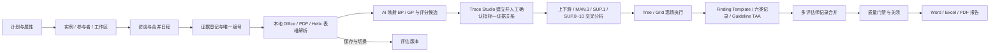

# AuditFlow AI 功能覆盖与部署边界

## ASPICE 评估主流程

## 功能覆盖

| 能力域 | Web 工作台实现 | 当前数据方式 |
|---|---|---|
| ASPICE 过程评估 | 七阶段评估、属性、多个过程实例、参与者、角色和独立工作区 | 浏览器本地持久化 |
| 现场执行 | Tree / Grid 双视图、BP/GP 快速评分、键盘快捷记录、Notepad 与实时筛选 | 浏览器本地持久化 |
| 评估师记录 | Strength、Weakness、Recommendation、Observation、Comment、Question；关联指标、实例、工作区和证据 | 浏览器本地持久化 |
| 一致性检查 | Guideline / TAA 的 Broken、Suspect、Handled 状态，评分变更后自动复算 | 本地规则引擎 |
| 多人合并 | 独立评估师记录、Consolidated 正式工作区、逐条或批量合并 | 浏览器本地持久化 |
| 自定义审核 | 方案、分类、单条/批量问题、判断参考、任务、逐题评估、结论和 Word 报告 | 浏览器本地持久化 |
| 多源证据 | 唯一 Evidence ID、多文件上传、拖放、文本粘贴、Office/PDF/Helix 表格读取、工作产品类型、记录引用保护 | 浏览器本地解析 |
| Helix 证据 | 识别 ID、状态、责任/批准、版本/基线、上下游追溯、影响/关闭字段，保留 Sheet/表格/行定位 | 浏览器本地解析与汇总 |
| 追溯工作台 | ASPICE 模型树、指标关系区、证据候选区；direct/corroborating/index-only 分类、Map Set 展示和人工确认/取消 | AI 推断 + 浏览器人工确认 |
| Finding Template | 按 BP/GP、过程域、记录类型和使用频率智能推荐，可转成项目评估师记录 | 浏览器本地方法库 |
| AI 专业意见 | Evidence → Process → BP/GP → Findings → Actions；证据限分、SUP 闭环、跨文件依赖、PA 门槛、O/W/R 与引用 | 本地规则 + 可选本机代理 |
| 场景化 AI 按钮 | 针对单个 BP/GP 或全项目追溯矩阵生成证据、关系、未证明事项、评分影响、访谈问题和关闭证据意见 | 本地规则 + 可选模型补充 |
| 人工审核 | 评分、理由、引用、发现增删改、复核状态、项目完成度 | 当前评估版本 |
| 版本管理 | 每次重新评估保存版本、预览、切换当前版本、保留旧版本 | 浏览器本地持久化 |
| 标准知识库 | 28 个过程、BP、GP、审核模型生命周期、Guideline、Overlay / IA、Finding Template、Map Set、要素集、提示词、评分和报告模板 | 前端参考库 |
| 审核模型生命周期 | Reference Model → Main Audit Model → Indicator Linking → Profile → Publish；不完整模型禁止发布 | 浏览器本地持久化 |
| 关闭与报告 | 记录/Guideline 质量门禁、不可修改事件日志、Word/Excel/PDF、跨过程结果和指标—证据追溯矩阵 | 浏览器生成 |
| 整改跟踪 | Weakness 责任、措施、验证和关闭状态直接写入评估记录，并纳入关闭门禁 | 浏览器本地持久化 |
| 实时 Dashboard | 审核阶段、证据解析、AI/人工复核、开放弱项、阻塞和 Helix 状态实时刷新 | 浏览器本地计算 |
| 设置与隐私 | 模型/MCP、Helix 解析、角色权限、数据保留、工作区备份/恢复 | 浏览器本地持久化 |
| 高级证据实验室 | 复用原有 Helix、Codex 桥接与本地多格式分析能力 | 打开原单文件工具 |

## 生产部署需要接入的基础设施

当前版本是可操作的本地优先 Web 工作台。多用户生产环境还需要：

- 服务端数据库、对象存储和大规模证据解析队列；
- SSO、团队/RBAC、项目隔离和不可篡改审计日志；
- 模型密钥托管、内容脱敏、调用配额和模型响应留痕；
- 电子签署、正式模板审批、报告版本归档和备份恢复；
- 针对组织裁剪后的评估要素、Guideline、Map Set 与提示词内容评审。

这些边界不会阻塞本地演示、内部方法验证和 UI/流程验收，但在处理真实客户证据前应完成安全与合规评审。
